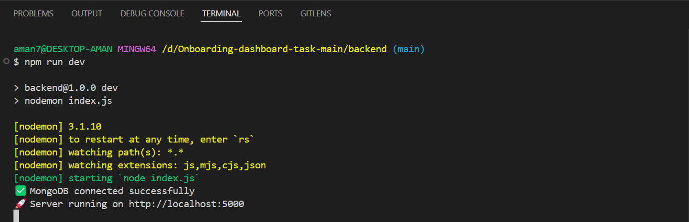
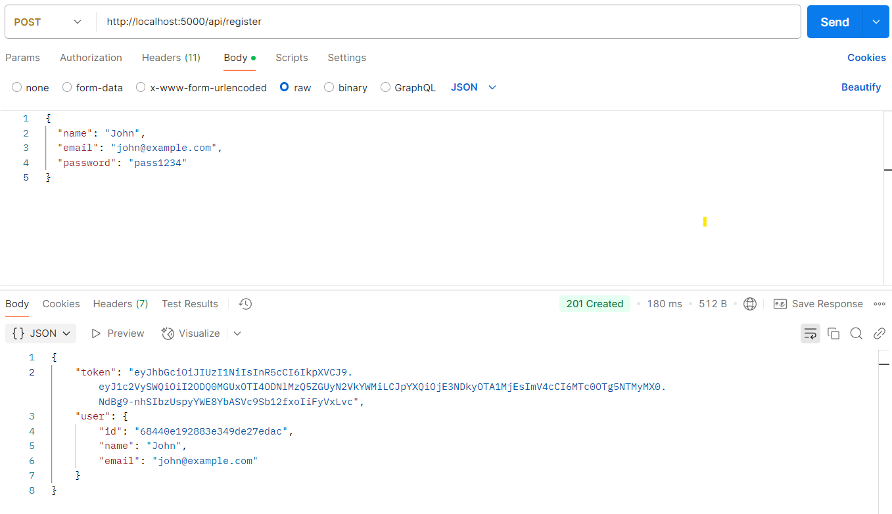
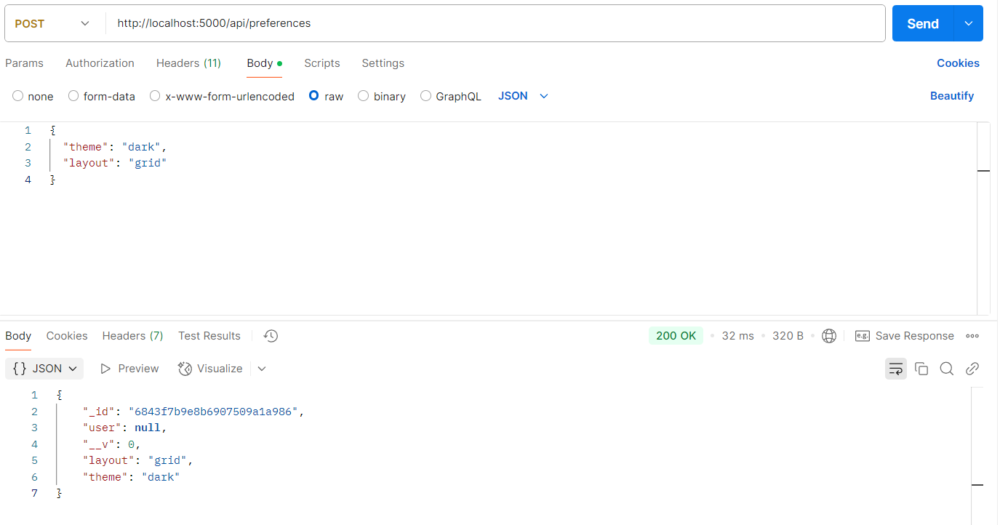
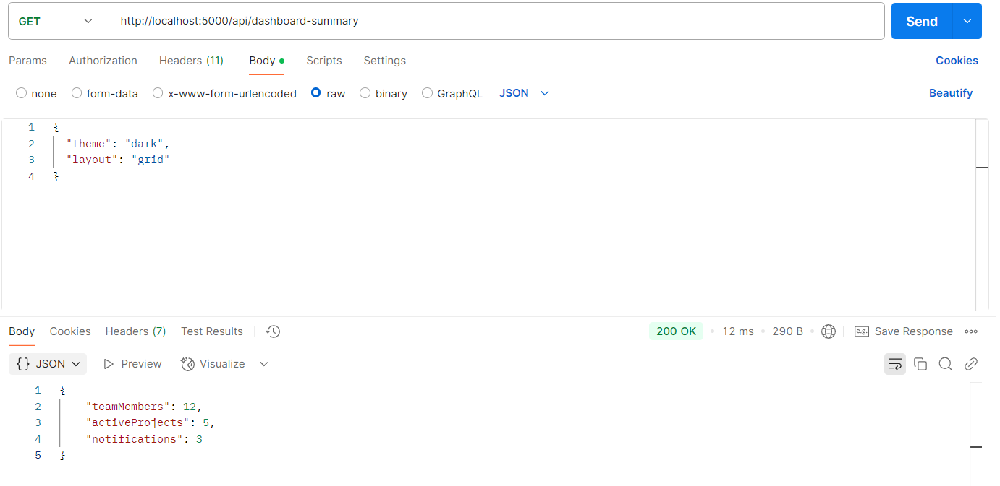

# 🔐 Authentication & Settings API

A secure backend API that provides user authentication, profile management, and preference saving using Node.js, Express, MongoDB, and JWT.

## 🚀 Tech Stack

- **Backend:** Node.js, Express.js
- **Database:** MongoDB (Mongoose ORM)
- **Authentication:** JWT, bcrypt
- **Validation:** Joi
- **Environment Config:** dotenv

---

## 📂 Project Structure

```
.
├── controllers/
│   ├── authController.js
│   ├── profileController.js
│   └── preferencesController.js
├── middleware/
│   └── authMiddleware.js
├── models/
│   ├── User.js
│   └── Preferences.js
├── routes/
│   ├── authRoutes.js
│   ├── profileRoutes.js
│   └── preferencesRoutes.js
├── .env
├── app.js
├── server.js
└── README.md
```

---

## 🛠️ Setup Instructions with 📸 Screenshots

1. **Clone the repository**
   ```bash
   git clone https://github.com/aman245002/backend-task
   cd auth-settings-api
   ```

2. **Install dependencies**
   ```bash
   npm install
   ```

3. **Configure environment variables**
   Create a `.env` file in the root directory:

   ```
   PORT=5000
   MONGO_URI=mongodb://localhost:27017/authSettings
   JWT_SECRET=your_jwt_secret_key
   ```

4. **Run the server**
   ```bash
   npm start
   ```

---




## 📡 API Endpoints

### ✅ Authentication

- **POST** `/api/register`
  - Request:
    ```json
    {
      "name": "John",
      "email": "john@example.com",
      "password": "pass1234"
    }
    ```
  - Response:
    ```json
    {
      "message": "User registered successfully"
    }
    ```

- **POST** `/api/login`
  - Request:
    ```json
    {
      "email": "john@example.com",
      "password": "pass1234"
    }
    ```
  - Response:
    ```json
    {
      "token": "JWT_TOKEN"
    }
    ```

- **GET** `/api/profile` _(Protected)_
  - Headers: `Authorization: Bearer <token>`
  - Response:
    ```json
    {
      "name": "John",
      "email": "john@example.com"
    }
    ```

---

### 🎛️ Preferences

- **POST** `/api/preferences` _(Protected)_
  - Request:
    ```json
    {
      "theme": "dark",
      "layout": "grid"
    }
    ```

- **GET** `/api/preferences` _(Protected)_
  - Response:
    ```json
    {
      "theme": "dark",
      "layout": "grid"
    }
    ```

---

### 🎁 Bonus Endpoints

- **GET** `/api/dashboard-summary` _(Protected)_
  - Response:
    ```json
    {
      "teams": 3,
      "projects": 5,
      "notifications": 12
    }
    ```

- **PATCH** `/api/profile` _(Protected)_
  - Request:
    ```json
    {
      "email": "new@example.com"
    }
    ```

---

## ✅ Features

- Secure JWT authentication
- Passwords hashed using bcrypt
- Input validation using Joi
- User-specific preferences storage
- Environment variable support
- Modular and clean folder structure

---


---

## 🙌 Acknowledgements

- [Express.js](https://expressjs.com/)
- [Mongoose](https://mongoosejs.com/)
- [JWT](https://jwt.io/)
- [bcrypt](https://github.com/kelektiv/node.bcrypt.js)
- [Joi](https://joi.dev/)

---

